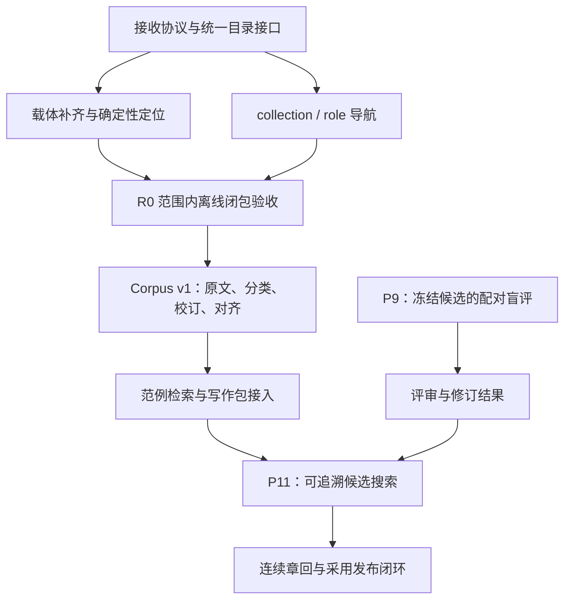

# RCWH｜来源闭包与语料建设后续设计 v1.1

- 日期：2026-10-08
- 依据：[完整设计 v1.0](RCWH_红楼梦复原基础设施完整设计_v1.0_20261008.md)
- 定位：来源、语料与写作输入的实施及验收契约。当前状态取自 `data/project/current.json` 选择的 owner，并用 `rcwh project acceptance` 实时计算。
- 操作：[资产接收](runbooks/ASSET_INTAKE.md)、[来源定位](runbooks/SOURCE_LOCATORS.md)、[导航与固定输入](runbooks/ASSET_DISCOVERY_AND_CORPUS_INPUTS.md)、[语料与评审](runbooks/CORPUS_AND_REVIEW_INPUTS.md)、[声明闭包](runbooks/DECLARED_INPUT_CLOSURE.md)。

## 1. 设计结论

实施顺序为 **R0 Repository Closure → Corpus v1／P9 → 范例接入 → P11 候选搜索**。R0 优先投入；P9 对已冻结候选的独立盲评可以并行，但文学评审通过不替代来源验收。完整世界／规划契约和连续章回生产沿用 v1.0 的领域路线，在来源与语料接口稳定后接入。

材料入库后，还须保证正式依赖可发现、可定位、可在干净检出中重建。数量和过去的测试结果不构成验收条件；覆盖率与缺口从当前明确的 root 集合计算。

## 2. 保持的领域边界与优先级修正

继续沿用 Asset／Source 分离、结构化 owner、版本引用、历史只供审计等既有契约。新增能力遵守四条边界：

1. **存储与解释分开。** SHA 正确只说明载体身份；定位通过说明摘录可重取；Claim 是否被支持仍由证据审查判断。
2. **来源抽取与完整语料分开交付。** R0 实现可复用的底层抽取和范围定位，不等待全前80切分、说话者标注或语义检索。
3. **组织元数据不赋予权威。** collection、role、tag、检索排名均不改变 Source tier、Claim、Decision 或 Adoption。
4. **入库与完成分开。** R0 只证明声明范围的来源和输入闭包；全书发布仍须世界连续性、真实评审和采用链验收。



不把 R0 承诺为固定几天的工作。网页能否取得原文、旧摘录是否与载体吻合、PDF／EPUB 是否同版，是本阶段的实际不确定性。获取受阻或原文不符时保留失败和后续动作，其他不依赖该条材料的任务可以继续。

## 3. R0：Source Closure 契约

### 3.1 验收范围和缺载体工作包

首轮 root 集合就是当前 `data/provenance/sources/` 加载出的全部 Source；现有模型尚无可供筛选的 active 字段。不得通过新增 active 过滤、删除失败 Source 或缩小集合达到零缺口。后续如需退役对象，必须记录替代版本、引用迁移及语义审查。

12 条缺载体记录可按现有 bibliography URL 分为 7 个采集组；这是采集计划，尚未验证网页可用性或正文一致性。一个 carrier 可以服务多个 Source，不能据此增加独立见证数量。

| 采集组 | Source 数 | 首要核对点 |
|---|---:|---|
| 《大清律例》卷三十六 | 3 | 外人入狱、亲属探视、待质衣粮三处条文与上下文 |
| 《光绪顺天府志》地理志四 | 1 | 监狱／狱神庙段落、版本及具体地方实例 |
| 《曹家档案史料》二百八十六 | 3 | 同一奏折的封固、当票、家属安置三处摘录 |
| 《大清律例》卷十 | 2 | 居丧嫁娶与主婚条文分别定位 |
| 《钦定大清会典则例》卷八十九 | 1 | 皇贵妃丧仪的条文和具体事例 |
| 大觉寺租房契录文 | 1 | 官网页面、契约日期和录文边界 |
| 毛立平 2013 年论文 | 1 | PDF 物理页与印刷页、摘录或概括的性质 |

队列从 Source 记录生成，保留 `source_ref`、待取载体、当前阻塞原因、处理结果和复核记录。项目研究报告中的转引可帮助找到出处，不能直接冒充原始 carrier。网页接收应保存实际内容字节、请求 URL／最终 URL、获取时间、响应类型和可取得的 revision 标识；登录页、验证码页、空壳 HTML 不满足内容闭包。

### 3.2 确定性抽取与 Locator v2

统一链路：

```text
Source 固定版本
  → carrier Asset（实际字节与 SHA）
  → ExtractionManifest（工具、配置、输入与输出摘要）
  → 指定文本单元和范围
  → 原始摘录＋显式转换记录
  → 与 Source.text / text_sha256 比较
```

已实现 `src/rcwh/corpus/extraction.py` 及格式适配器，供来源校验和后续 corpus 共用。正式抽取清单及输出放入 `corpus/extractions/<recipe-digest>/`，登记 manifest／输出文件资产与 `derived_from`；中间缓存进入 `.rcwh-cache/`。R0 不要求先构建前80章回数据集。

首期实现保留 UTF-8 原字符和换行，不含 OCR、校订或模糊匹配；HTML／EPUB 的实体解码与 `<br>` 换行有节点映射。配方记录实际 Python 完整版本、固定 PDF 依赖、代码和依赖锁摘要，重建要求这些输入一致。环境／规则变化须新建 extraction；旧配方不覆盖。历史 Source 的正式迁移在 R0.3 完成。

| 对象 | 最小契约 |
|---|---|
| `ExtractionManifest` | 输入资产 ID／SHA、抽取器名称与版本、代码摘要、依赖锁摘要、配置摘要、规范化规则、输出文件与摘要 |
| `Locator v2` | `kind`、`extraction_ref`、提取输出摘要、`unit_ref`、有序 `spans`、原始摘录摘要 |
| `VerificationReport` | Source 记录摘要、输入／输出摘要、定位器和校验器版本、结果、发现项、报告生成上下文 |

Locator 至少支持 `PDF_TEXT_SPANS`、`EPUB_TEXT_SPANS`、`HTML_TEXT_SPANS`、`TEXT_SPANS`。PDF 以从 1 开始的物理页为定位单位，印刷页只作辅助字段；EPUB 以 OPF spine 中的 item href 为单位，并保留 DOM／节点映射；HTML 定位到已固定的快照，不能在每次校验时访问 live URL。所有格式最终统一定位到确定的提取文本单元。

字符区间统一使用 Unicode code point 的零基、左闭右开 `[start, end)`，不能混用 UTF-8 字节或浏览器 UTF-16 offset。规范化文本与原文的对应关系须可追溯；多处摘引使用多个有序 span，连接符和省略须显式声明。

旧 `pdf_page`／`parsed_lines` 保存为迁移提示，不将旧行号套在新抽取器输出上。只有在绑定的提取流内重新找到范围、比较成功后才能形成新验证报告。若 PDF 抽取不可靠而 EPUB 能定位，须先确认文本及见证对应关系，再显式迁移 Source 的载体绑定；不能保持 PDF 引用却用 EPUB 查找成功冒充验证。

### 3.3 摘录差异、校订与失效

- 默认保留原字符、标点、空白及批注符号。确定性解码／换行规则记录在抽取配置中；繁简转换、异体字替换、去除批注或标点不是隐含容错。
- 原始 span 摘录与当前 `Source.text` 不一致时输出差异和 `EXCERPT_MISMATCH`。确需转换，登记可复现的转换／校订和前后摘要；涉及引文内容或见证解释的变动走证据审查，再生成新版本及影响报告。
- 概括性摘录不能伪装成逐字引用。确认属于转述时，显式区分引文与主张解释，并复核下游 Claim；不能为了过门禁让模糊匹配返回 PASS。
- 仅有扫描图像时保留待转录项。人工转录应登记为派生资产，逐字核对记录绑定图像位置；其人工核验与确定性文本重取分开报告。R0 首期自动定位器不将“人工标记已看过”当作通过。
- 载体、提取结果、Source、校订、规范化规则或校验器版本变化，都使原验证结果失效。运行时复算，不信任文件里自报的 `VERIFIED`。

Source 中保存期望定位及报告引用；报告中的 `PASS / FAIL` 是计算结果。`UNVERIFIED / STALE` 表示尚未核验或输入已变，同样阻断通过。schema 不应仅把 `UNVERIFIED` 的枚举放宽就接受成功；必须有实际可重取的验证证据。

### 3.4 统一检查入口

保留现有 `source-content` 与 `source-locators` profile，已新增应用服务 `verify_all`，由 `rcwh sources verify-all` 和既有 CLI 共用：

| 检查层 | 证明什么 | 不足以证明什么 |
|---|---|---|
| `source-content` | carrier 存在且摘要一致，Source 摘录自身摘要和图关系有效 | 摘录真的出现在 carrier 中 |
| `source-locators` | 固定 carrier／抽取配置能重取指定摘录，转换可追溯 | 文献学判断或 Claim 推理正确 |
| `sources verify-all` | 两项通过、root 非空、依赖与结果未失效 | 全书已采用或最终发布条件齐全 |

退出码约定：`0` 全部通过；`1` 数据或依赖不满足；`2` 调用／配置错误。报告至少列出 `root_set_digest`、各 Source 结果、缺 carrier／未定位／失效数量、工具与输入摘要。发现空 roots、提取器不支持、越界范围、多义定位、无匹配均失败。相同输入的语义结果稳定，运行时间等日志不参与产物内容摘要。

R0 验收要求当前全部 roots 的缺 carrier 和未验证 locator 均为 0，并逐条保留与原见证、tier、Claim／Decision 关系的语义比较；纯载体绑定不得改变这些关系。遇到真实引文问题，单独形成有依据的更正，不能纳入“无语义变化”批次。

## 4. 资产发现层与 Catalog 演进

### 4.1 先增加逻辑组织

物理路径继续按不可变身份组织。新增两类独立元数据，不复制原件，也不让分类修改资产字节：

- `data/catalog/annotations/<asset-key>.yaml`：`asset_ref`、`roles`、`tags`、`chapters`、可读标题。由 schema 限定 role 词表，tags 允许扩展。
- `data/catalog/collections/<collection-id>.yaml`：集合 ID、标题、用途、明确的版本资产成员列表。成员多对多；禁止仅按 basename 解析。

首批 role 为 `MASTER_DRAFT`、`GOVERNANCE`、`FRONT80_INDEX`、`CHAPTER_CARD`、`HISTORICAL_RESEARCH`、`LITERARY_REVIEW`；沿用现有 `kind` 表达存储类别。`PROJECT_RESEARCH` 属于 kind，不与 role 混作同一枚举。

首批 collection 覆盖核心母本、前80文学索引、证据治理、81—100章回卡与保护锁；用 `chapters` 支持“第89回相关材料”查询。返回 ID、标题、路径、角色及版本，集合顺序不代表当前权威。缺失成员、重复 ID、未声明 role 均由验证器报告。

拟新增接口：

```bash
rcwh assets list --role MASTER_DRAFT
rcwh assets list --collection collection:front80:literary-exemplars
rcwh assets list --chapter 89
```

README 提供阅读导航，实际成员由 catalog 元数据查询生成，不再维护另一套权威目录。

### 4.2 先封装读取，再切换分片

R0 先抽象 `CatalogStore`：枚举当前记录、按 ID 解析、读取指定 Git ref 的目录、返回所有需跟踪的元数据路径。现有 `AssetCatalog.resolve / validate / summary` 对调用者保持同一语义。任何调用方不得自行拼接 `assets.yaml`。

实际分片已在 R1 的 corpus 批量登记之前完成，迁移资产／origin 全集相等，后续批量产物进入分片布局。采用按完整资产 ID 的 SHA256 前两位分片；仅创建非空分片，记录按完整 ID 排序。该方案不依赖可变的角色分类：

```text
data/catalog/
  catalog.json                   # schema/layout 版本与分片清单；唯一布局入口
  assets/<00..ff>.yaml           # Asset 正式记录
  origins/<00..ff>.jsonl         # Origin 正式记录，按自身 ID 分片
  annotations/
  collections/
  assets.index.json              # 派生总索引，程序生成
```

`assets.index.json` 包含布局和全部输入分片／发现元数据的摘要；可提交供快速浏览，但不是正式记录。删除后可重建，过期时查询显式重建或报错；CI 用生成结果比较检查，不能只验证旧索引。

迁移须在同一变更中切换当前读取入口、tracked 检查、Git baseline 比较和 CI 的 baseline 探测。保留“读取旧 Git commit 中 v1 单文件”的能力用于不可变校验，当前工作树只采用一种布局；不能长期双写。缺分片、跨分片重复 ID、相同 SHA 重复实体和不可变版本被删除均失败。冻结资产身份、摘要与 origin 的前后全集做等价比较，单纯布局变化不新增资产版本。

每个 corpus segment 使用段落身份，不逐段登记 Asset；按 manifest、章节／JSONL 文件等实际字节产物登记。这样 catalog 的增长对应物理文件，而不是全文每一句。

## 5. 统一材料接收协议

### 5.1 接收状态与原子性

统一入口为已实现的 `rcwh assets ingest FILE --origin <origin> [--kind <kind>] [--role <role>] [--receipt-key <key>]`。联网抓取是采集步骤，接收器处理已取得的文件及采集元数据；批量接收协议按每项 receipt 再逐项分类扩展。首期接收单个文件，不要求自动打开所有格式或自动理解文献。

```text
RECEIVED → CLASSIFIED → BOUND
```

状态归属于接收记录，不能由自由文本自报：

| 状态 | 必须具备的事实 |
|---|---|
| `RECEIVED` | 原始字节已复制到仓库，摘要／字节数复核，Asset、Origin 与 receipt 均成功持久化 |
| `CLASSIFIED` | kind、存储归属及发现元数据已明确，仍不授予证据权威 |
| `BOUND` | Source／Claim／Plan／Review 等实际结构化对象引用该资产，并通过对应引用校验 |

receipt 至少记录 `receipt_id`、`asset_ref`、`sha256`、`original_filename`、`received_at`、origin、media type、`intended_role`、分类事实与绑定对象引用。多次收到相同字节保留多条 origin／receipt，共用一个 Asset。同一资产可有多个绑定；派生的绑定状态随当前有效引用计算，失去绑定时不得继续显示当前 BOUND。

未分类材料先放 `sources/inbox/<sha>/`，schema 增加明确的 `UNCLASSIFIED_INPUT` kind；分类后如需调整路径，只移动原件并更新 catalog 路径，保持 ID／字节不变。不要为了满足旧 kind 枚举将未知文件随意标成 primary 或 project。

实现要求：计算并复核完整 SHA；相同 SHA 去重；拒绝覆盖不同字节；同名不同内容建立不同 Asset；拒绝路径穿越、链接和大小写碰撞。多文件写入采用事务日志、暂存文件、互斥写锁和可恢复提交；中断后可继续或回滚，不允许只留下 catalog 条目而缺原件。幂等键绑定 receipt／origin，重试同一次接收不重复计数。

`RECEIVED` 表示本地接收完成；`tracked` 单独报告。接收命令不自动 commit，新文件未纳入 Git 时正式闭包检查仍失败。旧一次性交接导入器不作为新入口恢复。

### 5.2 必须入库的材料及聊天结论

| 材料 | 正式存储 | 后续绑定 |
|---|---|---|
| 红楼梦版本、批本、汇校本 | `sources/primary/` | Source、抽取输入 |
| 被采用的历史资料原件 | `sources/historical/` | Source 与历史机制研究 |
| 实际使用的网页内容 | `sources/web_snapshots/` | Source；URL 保留为出处 |
| 项目母本、计划、原始治理材料 | `sources/project/` | 当前选定的 Plan／治理对象 |
| 承重研究报告 | `research/` | Claim、OpenQuestion、Hypothesis 等 |
| 前80文本和范例 | `corpus/front80/<version>/` | 固定数据集、segment 与范例集合 |
| 真实人工评审 | `artifacts/reviews/` 原文＋`data/evaluation/` 结构化记录 | Review，绑定受评输入摘要 |
| 正式竞争候选、采用正文 | `artifacts/`；采用发布后进入 `releases/` | DraftRevision、Adoption、Release |

影响后续决策的聊天结论必须落为正式对象及依据引用：证据主张进入 Claim，未决项进入 OpenQuestion，备选解释进入 Hypothesis，文学意见进入评审／修订目标，采用决定进入 Decision／Adoption。对象尚未实现时先接收结论记录并登记待绑定任务，不虚构已经 BOUND，也不以会话链接承担有效内容依赖。

## 6. R1：Front80 Corpus v1

### 6.1 输入选择先于批量抽取

已登记候选输入是 `asset:primary:hlm:zhihui:v3.1416:pdf` 和对应 `:epub`。当前 EPUB 元数据包含出版日期、制作方及修订信息；仅凭两个资产 ID 的共同版本标签，尚不能认定两者逐字同版。R0 先形成版本核对报告，确认章回、批注标识、附录、缺字和主要异文，再由固定 build 配置声明主抽取源与校核源。

若两者存在差异，分别保留 witness／载体关系和差异记录，不能拼接成没有出处的“最佳文本”。EPUB 的结构通常适合切分，但采用它作为主抽取源要由本仓库的实际核对结果决定。

先制作有明确范围的 pilot，再建立 v1。pilot 包含普通正文、嵌入脂批、诗词、夹注、异文、附录靖藏抄录和不易分类片段，并覆盖现有 Source 所需的代表性位置。pilot manifest 声明实际覆盖，不能命名为完整前80验收。

### 6.2 数据产物及单一正文来源

沿用 v1.0 目标目录，并定义各文件的职责：

| 文件 | 职责 |
|---|---|
| `manifest.json` | dataset ID／版本、来源资产与抽取版本、build 配置／代码／依赖摘要、产物摘要和覆盖范围 |
| `segments.jsonl` | 正式文本段落及唯一段落身份，保存文字、分类、原文定位与摘要 |
| `annotations.jsonl` | 脂批内容、见证标识与所连正文的关系；通过 segment 引用，不再复制同一段文字 |
| `alignment.jsonl` | 不同载体、段落版本及拆分／合并的显式对应关系；未对齐项保留 |
| `corrections.jsonl` | 原字符、校订字符、原位置、依据、复核与前后摘要 |
| `editorial_tags.jsonl` | 说话者、关系、压力、场景功能、物质活动等可修订解释；允许 UNKNOWN |
| `chapters/` | 按 manifest 规则由 segments 生成的阅读视图，不另设手工正文事实源 |
| `quality_report.json` | 覆盖、分类、引用、摘要、对齐、重建与人工抽查结果 |

segment 最少包含 `dataset_ref`、`segment_id`、`chapter`、`section_ref`、`kind`、`text`、`text_sha256`、`asset_ref`、`locator`。正式引用使用 `(dataset_ref, segment_id)`，防止新版本同段号静默指向不同文本。正文切分或文字变化必须生成新数据集版本，并显式记录一对一、一对多、多对一或无对应的映射。

`kind` 明确区分 `MAIN_TEXT / ZHIPI / EDITORIAL / VARIANT / APPENDIX / UNCLASSIFIED`。脂批必须保留 witness、批注形式和正文关联；无法确认见证或关联时显式未知。附录可以有自己的 section，不能强行伪造成某回正文。原文中的诗词仍属于正文，其文体作为独立标注。

默认正文范例只读取已确认的 MAIN_TEXT；其他类别可显式查询。不确定块进入待核队列，分类规则与例外表纳入版本。不能只删除含批注符号的行，因为一行可能同时包含正文和批语。

### 6.3 重建、质量与检索

拟新增接口：

```text
rcwh corpus build --config <versioned-build-config> --output <new-directory>
rcwh corpus verify <dataset-id> --rebuild
rcwh corpus show <dataset-id> <segment-id>
rcwh corpus query <dataset-id> --kind MAIN_TEXT --chapter 32
```

正式 build 配置建议位于 `data/corpus/builds/`，只保存配方和固定引用，不存第二套正文。构建写入新目录，拒绝覆盖已有版本；manifest 不含机器路径、当前时间等不稳定内容，运行时间另记在 artifacts 日志。

Corpus v1 验收包括：

1. 配置声明的前80章回覆盖完整，目录与边界无重复遗漏；附录覆盖另外报告。
2. 每个 segment 都能从固定输入和校订重取，字节摘要、定位、关联引用有效；未决分类和未对齐数量如实列出。
3. 默认正文集合没有已知批注／编者按污染；对各格式特征分层抽查，人工记录与版本摘要绑定。主文边界仍未辨清的章节不能宣称完成。
4. 在声明、锁定的环境中删除缓存后独立构建两次，所有规范产物摘要相同；校订应用有前置摘要校验。
5. 缺原件、规则变化、越界 span、篡改校订、过期 manifest 都能阻断验证；跨平台换行通过 `.gitattributes` 的明确规则保护。

先提供确定性的关键词和元数据检索，语义向量后置为可重建缓存。已有前80 Markdown 索引逐条映射到 corpus segment；查不到原文的索引项保留未解析状态。检索结果必须带上下文、匹配理由、版本和定位；研究者标注不能自动升级为原文事实。

## 7. R2：接入文学实验与生产

这里将 P10 的工作边界规划为“Corpus／范例接入”，P11 为“候选搜索”；它们尚未成为新的 runtime gate。现有能力升级母本使用过不同阶段编号，实际阶段名称与状态继续取自被选中的结构化 owner；不能通过编辑历史母本重编号。

| 工作 | 前置条件 | 交付与边界 |
|---|---|---|
| P9 配对盲评 | 冻结 P8 原稿／修订稿、协议和匿名映射；评审依赖在本地可核对 | 独立评审记录、配对比较和修订效果；人工输入尚未取得时保持待评 |
| Corpus／范例接入 | R0 通过，Corpus v1 通过 | 固定范例集引用、索引映射、写作包中的文本／理由／上下文；盲包不暴露来源路线 |
| P11 候选搜索 | 所用语料与写作包可追溯，P9 修订结论有效 | 结构搜索→硬约束筛选→正文候选→独立评审；规模由任务配置，失败候选可审计 |
| 连续章回与发布 | 世界／规划版本契约、输入变更导致评审失效机制就绪 | 用第89回闭环及其他类型场景检验，再扩展连续章回、正式采用和发布 |

写作包固定 corpus dataset、segment、Source、世界／规划版本和全部输入摘要。原始语料／标注改变分别触发对应依赖失效；关键词／向量缓存重建不自动改变已冻结写作包。候选优化结果不自动修改 stable ACTIVE。

## 8. CI、自包含范围与接手协议

### 8.1 从正式 roots 走依赖

已新增 `data/project/closure_roots.json`，并经 project owner 显式选择：声明需要验收的 Source 集合、当前规划／研究输入、所选评审／候选及 corpus build 输入。Source 首期选择器必须覆盖全部已加载 Source，其他范围按当前业务对象声明；报告展示范围及摘要，禁止通过漏列依赖宣称全仓库完成。

验证器沿类型化引用遍历本地 Asset、结构化记录和确定性派生物。有效依赖不能落到外部聊天附件、绝对 `/mnt/data` 路径、未跟踪文件或隐含个人缓存；仅用于出处审计的 URL／旧路径允许保留，不能被解析器当作内容回退。所有选中 roots、配置、schema 和正式派生输出均纳入 tracked 检查。

### 8.2 分阶段启用门禁

- R0 开发期间：建立逐 ID、逐原因的缺口基线，报告缺 carrier、未定位和失效详情；新增缺口或已修复项倒退失败，成功项允许逐步增加。不能用“始终期待退出码 1”测试现有缺口。
- R0 完成时：删除临时缺口豁免，CI 要求 `sources verify-all --require-tracked` 与声明范围的输入闭包全部返回 0。旧 profile 与新入口必须给出一致定位判断；声明闭包另检查独立证据复核。
- R1 完成时：加入 corpus 重建检查；在安装声明依赖之后禁止网络、清空缓存、使用干净 clone 运行。离线使用不等于依赖安装也无需网络。
- 分片切换时：更新现有 `.github/workflows/validate.yml` 和 `tools/verify_foundation_checkout.py`，确保 immutable baseline 比较真正执行，不能因为找不到旧 `assets.yaml` 就跳过。

关键行为用测试保护：伪造 VERIFIED 无效；错误载体／范围／摘要失败；重复匹配不擅自选择；重复接收幂等；接收中断可恢复；分类元数据不改证据；分片前后语义一致；缓存删除可重建；原文与脂批不会在默认集合混合。避免以“正好 32 条 Source／151 个资产”断言业务正确。

### 8.3 新会话接手验收

从指定 commit 和声明环境开始，按 runbook 完成：读取 project status → 查询核心母本 collection → 查询当前待办和真实门禁 → 追溯一个 Decision 到原始摘录 → 重建所选 corpus → 打开固定候选与真实评审。

验收记录保存命令、环境摘要、root 范围、输出与失败原因。R0 通过可表述为“当前声明范围的来源／输入闭包通过”；完整基础设施和全书发布仍由各自验收决定。新 clone 若缺任何承重材料，必须明确指出具体对象及获取／修复任务。

## 9. 可审查的实施批次

每批都提交 schema／接口变化、必要行为测试和对应 runbook；涉及语义迁移时附前后比较。代码、数据与真实人工复核结果分别说明完成程度。

| 批次 | 实施范围 | 依赖 | 退出条件 |
|---|---|---|---|
| R0.1 接收与目录边界 | `CatalogStore`、receipt schema、幂等接收、失败恢复；保留当前目录布局 | 当前资产基础 | 新材料完整接收；旧资产身份、摘要和解析行为等价；新文件 tracked 状态明确 |
| R0.2 定位最小闭环 | ExtractionManifest、Locator v2、PDF／EPUB／HTML／文本适配、统一 verify 服务 | R0.1；格式样本可先独立验证 | 至少各目标格式走通成功和失败路径；自报状态不能替代重取 |
| R0.3 现有 Source 收口 | 7 组载体接收、32 条现有 Source 逐条定位、差异与语义复核 | R0.1、R0.2；获取工作可提前 | 当前全部 roots 缺 carrier／未定位为 0；真实更正有独立审查 |
| R0.4 导航与语料输入 | roles／collections、核心材料导航、PDF／EPUB 版本核对、固定 build 输入 | R0.1；可与 R0.2／R0.3 并行 | 能按用途／回次找到固定资产；主抽取源选择有核对依据 |
| R0.5 离线闭包 | root manifest、tracked 依赖检查、CI 零缺口门禁、接手演练 | R0.3、R0.4 | 干净检出中声明范围全部通过；无隐藏内容依赖 |
| R1.1 分片与 pilot | 目录分片／总索引、旧 Git baseline 读取、语料分类样本 | R0；分片先于 corpus 批量登记 | 目录语义等价；pilot 分类、定位、重建通过 |
| R1.2 完整 Corpus v1 | 全前80文本、批注、对齐、校订、质量报告 | R1.1 | 覆盖和分类达标；离线双构建摘要一致；版本引用稳定 |
| R2.1 范例与写作包 | 旧索引映射、确定性检索、冻结范例输入 | R1.2 | 前80范例可直接回到原文；盲评材料隔离路线信息 |
| R2.2 搜索与生产 | P11、世界／规划接入、评审失效、连续章回 | R2.1、有效 P9 结果及相应生产门禁 | 候选／修订效果可审计，连续性成立，采用与发布分别验证 |


每批验收后更新 `data/project/implementation.json` 的阶段状态。Plan／Review 的 BOUND 计算随对应领域接入；UI、向量检索、自动全文生成和大规模候选搜索排在基础门禁之后。操作与真实输入要求见[语料及评审 runbook](runbooks/CORPUS_AND_REVIEW_INPUTS.md)，设计完成不能计作运行能力完成。
