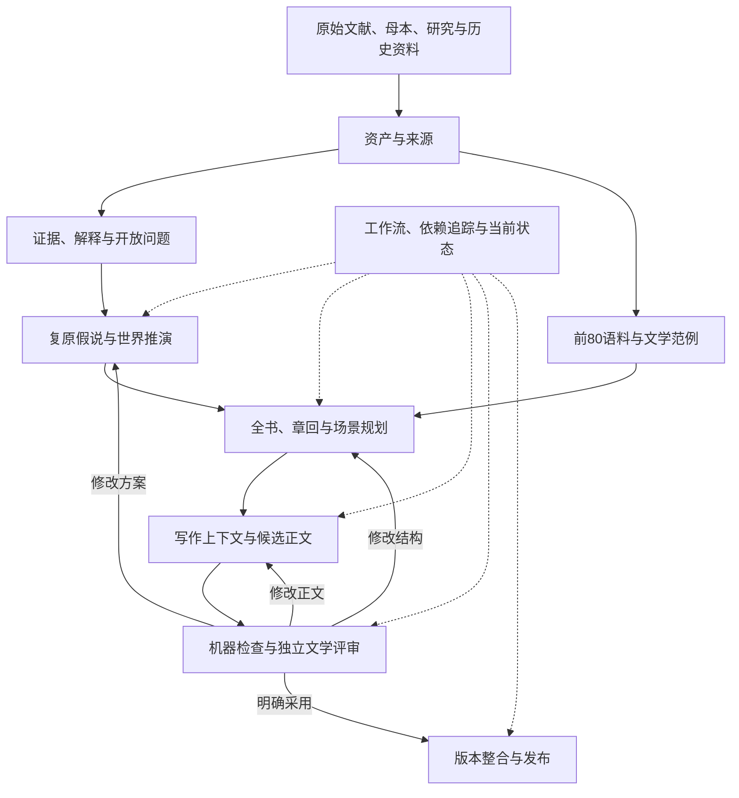

# RCWH｜红楼梦八十回后复原基础设施完整设计 v1.0

- 日期：2026-10-08
- 项目：RedChamberWorldHarness（RCWH）
- 文档性质：目标架构与实施设计
- 后续细化：[来源闭包与语料建设 v1.1](RCWH_来源闭包与语料建设后续设计_v1.1_20261008.md) 定义 R0、Corpus v1 和范例接入的实施与验收契约。
- 状态：**目标设计，部分模块已实施；完整基础设施与文学生产尚未验收完成。** 当前事实取自结构化 owner；实时输入验收用 `rcwh project acceptance`，操作与独立意见的接收要求见[语料及评审 runbook](runbooks/CORPUS_AND_REVIEW_INPUTS.md)。
- 设计目标：建设“可追溯、可推演、可创作、可评审、可发布”的红楼梦复原工作台。

本文将仓库整理、代码重构、语料建设和文学工作流纳入同一目标架构。它承接此前的仓库自包含评审，并将设计范围扩展到复原基础设施。此前提出的旧记录兼容绑定层，在本设计中仅承担迁移过渡职责，具有明确退出条件。

## 1. 项目定位与成功标准

仓库整理、代码重构、语料建设都服务于文学复原。设计是否成功，要看研究者能否依靠系统完成连续章回的复原、比较和修订，并解释每个重要选择的依据。

系统的目标是：

> 建设一个以证据为边界、以文学完成度为目标、支持多种复原方案竞争的研究与创作工作台。

它应让复原过程有据可查、可以比较和修正。产出的具体情节仍然是复原选择，不能因为通过系统验证就被认定为失稿原文。

研究者应能仅凭一个确定的仓库版本和声明的运行环境，找到正式承重材料，理解当前工作状态，提出和比较复原方案，写出连续章回，完成有依据的修订，最终发布内部自洽、经过真实文学评审的版本。

## 2. 八个稳定领域

系统围绕八个稳定领域组织：

| 领域 | 核心职责 | 主要产物 |
|---|---|---|
| 资产与来源 | 保存材料、识别版本、记录出处、解析定位 | 资产目录、来源链、引用定位 |
| 语料与范例 | 分离正文和批注，建立可检索的文学实例 | 版本化语料、段落、标注、范例集 |
| 证据与解释 | 管理见证、主张、支持关系、争议和 OPEN | 证据图、边界与解释记录 |
| 假说与世界 | 比较复原假说，推演人物、事件、知识和物件状态 | 方案分支、事件链、世界快照 |
| 全书规划 | 组织人物线、跨回因果、章回结构和叙述安排 | 全书方案、章回卡、场景契约 |
| 写作与修订 | 准备写作上下文、生成候选、处理编辑意见 | 候选正文、修订记录、差异说明 |
| 评估与裁决 | 检查合法性、比较文学效果、记录采用理由 | 检查报告、盲评、裁决记录 |
| 版本与发布 | 固定依赖、验证发布条件、管理正式版本 | 发布清单、纯读版、注释版 |

M1—M8、P0—P8 继续作为历史里程碑存在。新系统的运行结构由上述领域决定。



## 3. 工程架构与仓库布局

### 3.1 模块化单体

工程上采用模块化单体：一个仓库、一套 Python 内核、多种使用入口。

CLI、本地编辑界面和模型调用工具访问同一套应用接口。校验、状态转换和采用规则集中在内核，避免界面、脚本和模型各自实现不同规则。

### 3.2 目标目录

以下为目标目录，实施时按领域逐步落地：

```text
README.md
CONTRIBUTING.md
pyproject.toml

sources/                         原始材料，保留原始字节
  primary/                       红楼梦原文、版本及批评材料
  project/                       母本、正式计划、原始项目规范
  historical/                    历史一手材料与二手研究
  web_snapshots/                 被正式使用的固定网页载体

research/                        项目研究成果
  mechanisms/
  literary_ecology/
  investigations/

corpus/
  front80/<dataset-version>/
    manifest.json
    chapters/
    annotations.jsonl
    segments.jsonl
    alignment.jsonl
    corrections.jsonl
    editorial_tags.jsonl
    quality_report.json
  reference_editions/            后出续书等独立对照语料

data/
  catalog/                       资产身份、来源和派生关系
  provenance/                    Source、Claim、证据决策、OPEN
  mechanisms/                    历史机制及适用范围
  hypotheses/                    假说及其支持、冲突、代价
  worlds/                        世界基线、分支事件与状态
  plans/                         全书、人物线、章回、场景、叙述计划
  editorial/                     修订任务、采用决定、编辑记录
  evaluation/                    评估协议和结构化结果
  project/                       当前选择、工作流与治理配置

artifacts/
  runs/                          固定的模型输入输出与实验结果
  review_packages/               评审材料和解盲后的映射
  migration/                     导入、转换、等价性与验收报告

releases/
  <release-id>/
    manifest.json
    readable/
    annotated/

archive/
  imports/                       原交接清单、来源映射
  milestones/                    历史阶段状态和验收
  superseded/                    已退出当前运行的研究、规则

src/rcwh/
  assets/
  corpus/
  provenance/
  mechanisms/
  world/
  planning/
  composition/
  evaluation/
  publication/
  workflow/
  application/                   用例编排
  interfaces/                    CLI、模型工具、本地界面接口

schemas/
tests/
docs/
  architecture/
  decisions/
  governance/
  runbooks/

requirements/                    经过验证的依赖锁定
.rcwh-cache/                     可删除、可重建的索引和缓存
```

### 3.3 目录职责边界

原件按来源和用途归属，扩展名不决定权威。原始 Markdown 母本、评审记录和正式正文都是有效资产。

`sources/` 保存原始输入；`research/` 保存项目分析；`corpus/` 保存文本派生物；`data/` 保存机器解释、引用和状态；`artifacts/` 保存具体实验与评审输入输出；`releases/` 保存正式发布版本。

`archive/` 保存历史事实，当前运行不自动扫描它。旧代码主要通过 Git 历史保存，避免再次复制整套旧工作树。

正式语料的权威位置统一为 `corpus/`。`data/` 中的业务对象引用语料版本和段落，不维护另一份正文语料库。

## 4. 领域对象、身份与依赖

所有正式对象需要明确身份、版本和依赖，不必把所有工作笔记都数据库化。

### 4.1 最小领域模型

| 对象 | 表达什么 | 必须记录的关键关系 |
|---|---|---|
| Asset | 一份确定的文件版本 | SHA、实体路径、来源、派生输入 |
| Source | 某个见证中的具体材料 | witness、asset、locator、摘录 |
| Claim | 可以讨论和判断的原子主张 | 支持、反对、适用范围、判断状态 |
| OpenQuestion | 尚未确定的问题 | 已知边界、待辨候选、相关材料 |
| Hypothesis | 对开放问题的具体解释 | 所需假设、支持、冲突、推演后果 |
| ReconstructionBranch | 一个可执行的复原方案 | 采用的假说、世界基线、事件增量 |
| BookPlan | 某方案的全书组织 | 人物线、事件链、章回和回应关系 |
| SceneContract | 一个场景的创作条件 | 前置状态、参与者、功能、退出状态 |
| DraftRevision | 一版具体正文 | 所属方案、场景、父版本、生成输入 |
| Review | 对确定材料的检查或评价 | 输入摘要、协议、评审者、意见 |
| Adoption | 一次明确采用 | 采用对象、范围、理由、剩余问题 |
| Release | 一次固定发布 | 正文、依赖、裁决、检查与版本 |

### 4.2 身份与版本规则

ID 不依赖文件路径；内容修订有明确版本。正式引用必须指向确定版本，不能在运行时悄悄解析到“最新文件”。

Asset 标识固定文件版本；Source 表达见证与摘录。文件入库不自动提高其证据权威。相同内容的多个来源出现记录应保留，但不能据此增加独立证据数量。

### 4.3 类型化依赖

依赖关系至少区分：

- 来源与派生关系；
- 证据支持与反对关系；
- 假说依赖与互斥关系；
- 世界状态和场景前置关系；
- 采用与发布关系。

依赖图由正式记录生成，不成为另一份需要人工同步维护的数据。

## 5. 真值、作用范围与历史机制

“事实”必须带有作用范围，避免某个复原版本的选择扩散成全局事实。

### 5.1 五个真值与信息层次

继续保留现有真值分层，并补充读者信息管理：

| 层次 | 负责回答的问题 |
|---|---|
| 证据层 | 现存材料究竟支持什么？ |
| 复原版本层 | 在这个方案中，具体发生了什么？ |
| 人物知识层 | 某人物此刻知道、推测或误解什么？ |
| 文本权限层 | 哪些字句必须准确保留，哪些只是来源措辞？ |
| 叙述与读者层 | 这一时刻允许读者知道什么，通过谁、以何种方式知道？ |

### 5.2 OPEN 与正文安排

研究层的 OPEN，不要求正文故作含混。

某个版本可以清楚写出它采用的事件安排，并在注释或研究记录中说明这是复原选择。人物也可以误判；人物说错了，不等于证据层发生了错误。

### 5.3 历史机制的适用范围

历史机制记录时代、地域、身份、制度条件和例外。历史上存在某种程序，可以支持情节的可行性；它对小说具体事件的支持范围需要单独判断。

历史机制与复原事件建立可追溯关联，但不能因为史料权威高，就自动锁定小说中的具体人物、时间和程序。

## 6. 约束分级与变更权威

约束需要分级，并明确谁有权改变它。

| 约束 | 默认处理 |
|---|---|
| 来源与证据边界 | 阻止伪造来源、越级推断和无依据关闭 OPEN |
| 版本内连续性 | 保证当前方案自洽；方案改选后可以显式重算 |
| 实验控制条件 | 仅在对应实验中生效 |
| 文学策略 | 提供建议，允许有理由的例外 |
| 当前操作安排 | 控制工作顺序，不改变证据与文学权威 |

现有各阶段的禁令逐条重新归类。某次实验限定叙述视角、禁止改变事件结构或要求固定场景窗口，都应保留适用范围。

机器发现问题后，输出“触犯什么条件、证据在哪里、影响哪些对象”。文学建议不应通过不断升级为硬规则来获得执行力。

## 7. 复原分支、世界推演与全书规划

世界推演和全书规划是连接研究与正文的核心。

### 7.1 复原分支

每个复原分支由“共同基线＋明确采用的假说＋事件增量”构成。分支之间共用材料和机制定义，拥有各自的事件安排与世界状态。

Git 分支用于工程协作，复原分支是领域对象。一个 `main` 中可以同时保存多套正在比较的复原方案。

### 7.2 四个规划尺度

| 尺度 | 重点对象 |
|---|---|
| 全书 | 人物命运、主要关系、家族变化、主题发展、整体结局 |
| 跨回 | 因果延续、资源变化、伏笔回应、人物转变、信息传播 |
| 章回 | 线索交织、叙事重量、场景顺序、回目与回末作用 |
| 场景 | 具体行动、参与者、物件、知识条件、叙述安排 |

### 7.3 事件顺序与获知顺序

维护两套时间：事件发生顺序与读者获知顺序。叙述计划可以改变后者，同时保持事件链可解释。

### 7.4 未完成事项

全书规划维护未回应的伏笔、未完成的人物线、尚未交代的物件去向和被延后的关系冲突。

这些记录帮助编辑发现遗忘，但不要求每条线索都机械闭合。

目前规划的 81—100 回作为项目配置保留，核心模型不把它当作原稿篇幅的证据断言。

## 8. 语料与文学范例系统

语料系统同时承担原文追溯和文学范例服务。

### 8.1 三个组成部分

| 部分 | 内容 | 权威边界 |
|---|---|---|
| 文本基础 | 原文、正文与批注分类、段落、定位、校订 | 忠实反映所选版本 |
| 编辑标注 | 人物、说话者、关系、场景功能、叙述技法 | 可修订的分析判断 |
| 检索服务 | 关键词、条件筛选、相似性与排序 | 帮助发现材料 |

### 8.2 版本与分类

PDF 和 EPUB 分别登记。确认版本与文本差异后，再决定主要抽取源和校核源。

每个正式段落绑定数据集版本、输入资产和定位。切分或文字发生变化时生成新数据集版本，提供旧新段落映射。

正文、脂批、编者说明、异文、附录显式区分。不确定内容进入待核区，不能进入默认正文范例集。

### 8.3 文学范例

文学范例保留上下文。人物声音标注考虑“对谁说、处于何种关系和压力下”，不能只有人物名字与口头禅。

检索到的片段说明为什么适用、哪些条件不同。文学上的相似性不自动成为后80情节的证据支持。

首期固定文本、结构与定位；语义索引作为可重建缓存。正式使用的范例集合随写作任务保存，以便追溯正文受到哪些材料影响。

## 9. 场景写作包与候选生成

写作接口的核心产物是一份可审查的场景写作包。

### 9.1 写作包内容

写作包包含：

- 本次写作的版本、章回、场景和具体目标；
- 必须遵守的证据边界；
- 本版本已经选择的假说；
- 场景前置世界状态、人物知识和物件状态；
- 本场景承担的关系变化与章回功能；
- 叙述计划及允许的调整范围；
- 经过筛选的文学范例；
- 上下文正文和需要延续的问题；
- 输出格式、检查条件和必要的资源限制。

### 9.2 上下文与输出边界

这些内容从仓库正式对象生成。聊天可以提出工作要求，正式决定和被采用的新材料必须落回相应对象。

生成器输出候选正文、建议的状态变化和需要编辑判断的问题。

**正文生成不能直接写入证据层、正式世界状态或 ACTIVE 发布指针。**

正文与结构化状态之间的一致性，可以由机器辅助发现问题。涉及动机、暗示和叙述含义时，仍需要编辑核对，不能把模型抽取结果当作完整的形式证明。

## 10. 工作流、资格与采用

工作流支持探索，同时控制采用和发布。

### 10.1 三种资格

| 资格 | 条件与效果 |
|---|---|
| 可以探索 | 已声明假设和输入；允许形成实验候选 |
| 可以评审 | 材料固定、检查完成、评审协议明确 |
| 可以采用或发布 | 相关依赖与裁决满足要求，状态转换明确 |

第89回尚未裁决时，可以在标明前提的分支中探索后续章节；这些探索不会自动成为正式承继关系。

### 10.2 候选与发布状态

候选正文可以经历“草稿、可评审、修订中、已采用、已替代”等状态。

发布物采用独立状态，避免“某个场景已采用”被误解为“全书已获准发布”。

### 10.3 采用范围与报告有效性

采用决定必须包含范围：采用一句话、一段场景、整回文字或整套方案，影响不同。

修改已评审的正文后，原报告只能继续证明原来的版本；相关评审应失效或重新确认。

## 11. 跨回修订与变更影响分析

跨回修订由依赖图驱动，减少对作者记忆的依赖。

### 11.1 变更传播示例

调整某方案的婚期时，系统应当：

1. 找到依赖该安排的身份、称谓、居所、关系和事件；
2. 重新推演受影响的世界状态；
3. 标出需要重审的场景与正文；
4. 区分必须修订、需要人工检查和不受影响的部分；
5. 生成修订任务；
6. 固定新版本，并保留原采用理由与修改原因。

### 11.2 不同变更的传播方式

变更传播至少区分：

- 来源变化，需要重审证据与解释；
- 假说改选，需要重算事件与状态；
- 章回结构调整，需要重审信息释放和节奏；
- 局部文字润色，通常只需检查有限范围。

系统不应每次都要求全书从头重验，也不能因变更看起来很小就跳过真实依赖。

## 12. 评估、独立阅读与盲评

评估体系同时保护可信性和文学效果。

### 12.1 四类评估

| 类别 | 内容 | 结果用途 |
|---|---|---|
| 来源与证据 | 原件、定位、支持范围、OPEN、引用身份 | 确定研究与事实边界是否成立 |
| 世界与连续性 | 时间、人物知识、物件、资源、关系、前后文 | 判断所选方案是否自洽 |
| 文学诊断 | 声音、行动、节奏、叙述、文化材料的场景作用 | 提供修订线索 |
| 独立阅读 | 可读性、人物可信度、章回效果、整体余味 | 为实际采用提供判断 |

硬性错误可以阻断评审或发布。文学诊断保留分项意见，避免用一个总分掩盖问题。

### 12.2 报告绑定

每份报告绑定候选摘要、输入上下文、评估器或评审协议版本。对模型评审还需记录实际输入输出，不能只存最终评分。

### 12.3 盲评边界

盲评通过专门导出的匿名材料进行。评审者如果能访问完整映射和生成记录，仅更换文件名不能保证盲性。

解盲后保存映射和原始结果，完成审计闭包。

### 12.4 Harness 效果验证

评价新 Harness 是否有效，应采用同任务对照：相同材料和相近预算下，比较旧流程、新流程及必要的直接写作基线。

关注错误是否减少、修订是否有效，以及实际阅读是否改善。

## 13. 模型接入与运行记录

模型能力通过可替换的适配器接入，正式状态由内核管理。

生成、检索辅助、批评、信息抽取都可以使用模型，但它们承担不同任务，需要不同输入与评价方式。

### 13.1 正式运行的记录

每次正式运行记录：

- 输入对象及其版本；
- 上下文包和提示配置；
- 模型、参数及工具配置；
- 实际输出；
- 后续检查和采用关系。

已有结果的审计不依赖重新调用模型。确定性文本处理需要可重建；非确定性生成通过保存实际输入输出实现可追溯。

### 13.2 角色与执行方式

逻辑上的“作者”“批评者”“编辑”角色不必与独立进程绑定。首期用清晰的任务接口和工作流即可运行，后续再根据实际收益扩展执行方式。

## 14. 公共接口与应用服务

公共接口围绕用户任务，内部模块不得绕开状态转换规则。

### 14.1 用例接口

| 用例 | 输入 | 输出 |
|---|---|---|
| 解析来源 | Asset/Source 引用 | 文件、定位与核验结果 |
| 追溯结论 | Claim/Decision/正文引用 | 依据、推理和采用链 |
| 推演方案 | 分支、假说与事件 | 世界状态、冲突和压力 |
| 分析变更 | 旧新对象版本 | 影响范围与重审任务 |
| 编译写作包 | 分支＋场景＋正文版本 | 固定的创作上下文 |
| 生成或修订 | 写作包＋任务 | 候选及运行记录 |
| 组织评审 | 候选集合＋评审协议 | 匿名材料和报告 |
| 执行采用 | 裁决记录＋目标范围 | 新状态与依赖更新 |
| 验证发布 | 发布候选 | 完整依赖清单与门禁结果 |

CLI 和本地界面调用这些应用服务。文件格式由 schema 约束，跨对象关系由领域校验器检查。

### 14.2 历史接口退出

旧 CLI 可以提供短期适配，但必须标记退出条件。旧包路径和旧 registry 解析只能存在于导入转换流程中，不能成为新运行内核的永久依赖。

## 15. 本地研究与编辑工作台

本地工作台让研究者看到问题和依据，减少直接维护全部 JSON 文件的负担。

### 15.1 五个优先视图

- **研究视图**：原文、定位、主张、争议和相关假说。
- **方案视图**：不同复原路线的选择、后果、冲突与代价。
- **全书视图**：章回、人物线、因果链、伏笔和未完成事项。
- **写作视图**：正文、场景条件、范例、检查结果和修订意见。
- **版本视图**：采用记录、依赖变化、发布候选与正式版本。

### 15.2 唯一状态来源

界面中的状态来自正式数据。README 和项目状态页也从同一来源生成，避免再次手工复制多份“当前状态”。

人工精力集中在证据解释、方案取舍、文学评审和发布判断；例行导入、哈希检查、上下文整理与报告生成由系统执行。

## 16. 自包含、复现与持续验证

自包含和复现是持续工程能力。

### 16.1 存储边界

此前盘点的原始资产约 20.6 MB，首期可以直接纳入普通 Git。正式语料和必要实验输出也入库；索引、中间抽取结果和临时文件按是否承重决定保留方式。

### 16.2 三种验收目标

| 目标 | 验收内容 |
|---|---|
| 内容闭包 | 正式结果依赖的材料、记录和定位均可在本地找到 |
| 离线使用 | 安装声明环境后，追溯、验证、阅读已有结果无需网络 |
| 确定性重建 | 固定工具、配置和校订可以重建正式语料等确定性产物 |

校验从明确的正式对象出发遍历依赖。历史出处记录可以包含旧 URL 和 ZIP 名称，但有效内容依赖必须解析到真实本地载体。

### 16.3 CI 与测试

CI 检查 schema、引用、文件摘要、状态转换、派生物一致性和关键行为。

原来的阶段计数与旧目录形状测试移入历史迁移验收；新测试保护业务语义。

默认测试范围明确限定到 `tests/`。导入暂存材料不参与测试发现和运行加载，解决当前展开交接包造成的冲突。

## 17. 迁移实施与历史负担淘汰

迁移采用逐领域替换，每个领域都有关闭旧运行链的条件。

### 17.1 实施阶段

| 阶段 | 主要交付 | 可以进入下一阶段的条件 |
|---|---|---|
| 设计契约与基线 | 对象模型、权威规则、冲突清单、现有行为基线 | 每项历史负担有保留、替换或废弃理由 |
| 资产与来源 | 原件入库、目录、定位与来源解析 | 正式引用可到达本地文件，缺失项明确 |
| 证据与世界内核 | 新模型、转换程序、方案状态与推演 | 重要证据语义、OPEN 和既有发布身份保持可解释 |
| 单回生产闭环 | 规划、写作包、候选、检查、评审、修订 | 实际走通一回，证明对研究与写作有用 |
| 连续章回与语料 | 全前80基础、跨回规划、变更传播 | 连续两三回成立，修改影响可追踪 |
| 全书整合与发布 | 方案比较、全书编辑、版本和发布 | 全书依赖闭包、连续性与真实评审通过 |
| 历史兼容退出 | 删除旧加载器、覆盖链和失效测试 | 新内核独立运行，旧材料仅承担审计用途 |

### 17.2 首个生产闭环

首个闭环可以使用现有第89回候选，另选不同类型场景做回归，避免新设计只适配一个案例。

### 17.3 转换与语义等价性

转换过程生成语义等价性报告：哪些是路径和格式变化，哪些是重复信息合并，哪些是真正的规则调整。

发现有价值的旧行为就移植；发现错误约束就明确废弃。不能以“全部旧测试继续通过”作为唯一成功标准。

旧阶段固定计数、旧包路径、层叠状态覆盖和只为旧布局服务的接口退出当前运行链。历史材料、真实评审、正式发布和重要采用理由按其审计价值保留。

## 18. 最终验收

最终验收同时覆盖工程、研究和文学三方面。

| 验收问题 | 必须提供的证据 |
|---|---|
| 新会话能否接手？ | 仅用指定 commit 和声明环境恢复当前工作状态 |
| 任一结论能否追溯？ | 从采用结果走到具体材料、位置与解释记录 |
| 多种方案能否比较？ | 共用材料、隔离状态、明确差异和采用理由 |
| 修改能否传播？ | 对跨回变更给出正确的受影响范围 |
| 能否完成连续写作？ | 连续章回的正文、检查和编辑记录 |
| 是否改善文学成果？ | 可比较候选、独立评审和有效修订的证据 |
| 是否消除了历史负担？ | 当前运行不再依赖旧包路径、阶段计数和层叠覆盖 |
| 能否正式交付？ | 固定正文、依赖清单、真实裁决和可核验发布记录 |

## 19. 实施前需要定稿的五份设计契约

1. **领域对象与引用规范**：对象身份、版本、schema、来源和类型化依赖。
2. **权威与状态转换规范**：证据、复原选择、约束级别、工作资格、采用和发布。
3. **全书规划与场景契约**：规划尺度、世界推演、人物知识、叙述安排、写作上下文。
4. **评估与采用协议**：检查类型、报告绑定、独立阅读、盲评、比较与裁决。
5. **迁移与验收规范**：转换映射、语义等价性、历史负担处置、旧运行链退出和最终验收。

它们共同决定仓库应如何组织，也决定 Harness 最终能否支撑有依据、有连续性、有文学完成度的复原工作。
